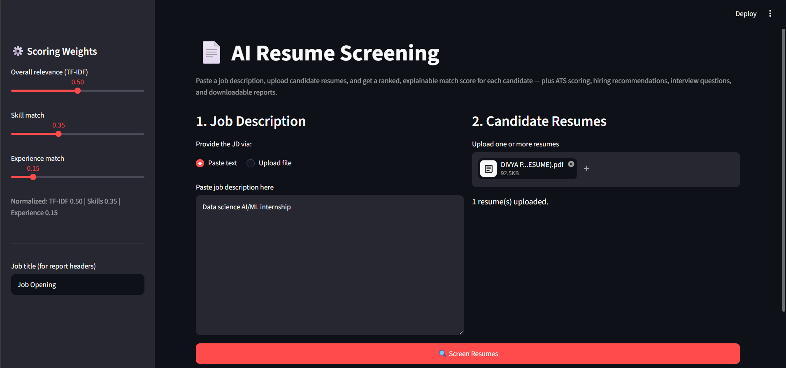
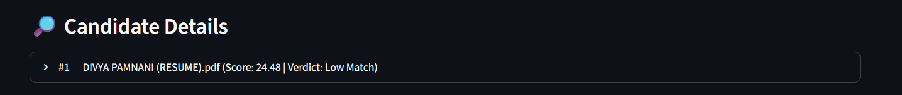
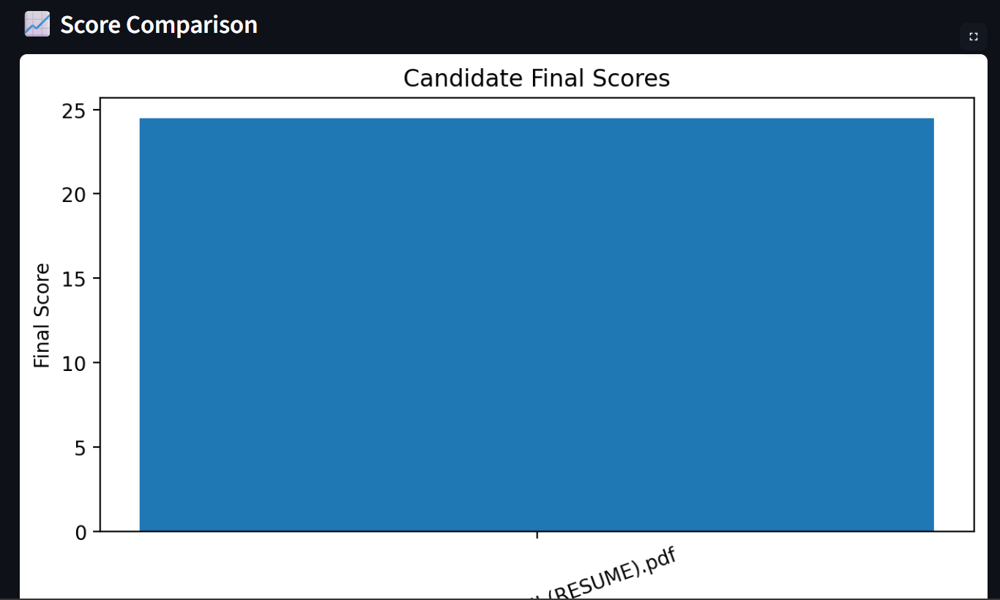
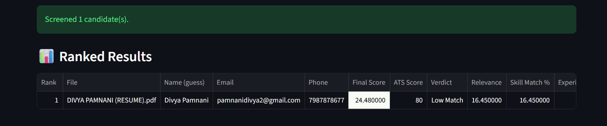
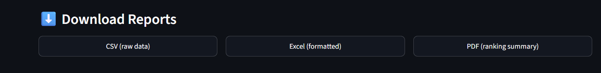

# 📄 AI Resume Screening System

An AI-powered Resume Screening System built using **Python** and **Streamlit** that automatically ranks candidate resumes based on a Job Description (JD). The application calculates ATS scores, generates interview questions, provides hiring recommendations, and exports reports in PDF and Excel formats.

## 🌐 Live Demo

https://ai-resume-screening-ngqorg79rksztvtm62sd9k.streamlit.app/

---

## 🚀 Features

- 📄 Upload multiple resumes (PDF, DOCX, TXT)
- 📝 Paste or upload a Job Description
- 🤖 AI-based resume ranking using TF-IDF similarity
- ✅ ATS Compatibility Score
- 📊 Resume ranking with detailed score comparison
- 💡 Hiring recommendations
- 🧠 AI-generated candidate summary
- ❓ Interview question generation
- 📈 Visual charts for candidate analysis
- 📥 Export results to Excel and PDF reports

---

## 🛠️ Technologies Used

- Python
- Streamlit
- Pandas
- NumPy
- Scikit-learn
- PDFPlumber
- Python-docx
- ReportLab
- OpenPyXL
- Matplotlib

---

## 📂 Project Structure

```
AI-Resume-Screening/
│
├── app.py
├── matcher.py
├── resume_parser.py
├── ats_score.py
├── recommendation.py
├── ai_summary.py
├── interview_generator.py
├── charts.py
├── pdf_report.py
├── excel_export.py
├── skills_data.py
├── requirements.txt
└── README.md
```

---

## ⚙️ Installation

Clone the repository:

```bash
git clone https://github.com/divya-pamnani/AI-Resume-Screening.git
```

Go to the project folder:

```bash
cd AI-Resume-Screening
```

Install dependencies:

```bash
pip install -r requirements.txt
```

Run the application:

```bash
streamlit run app.py
```

---


## 📸 Screenshots

### 🏠 Home Page


### 📤 Uploaded Resumes



### 👤 Candidate Details



### 📈 Score Comparison



### 📊 Screened Results



### 📥 Download Reports



---

## 📊 Output

The application provides:

- Candidate Ranking
- ATS Score
- Matched Skills
- Missing Skills
- Hiring Recommendation
- AI Summary
- Interview Questions
- PDF Report
- Excel Report

---

## 👩‍💻 Author

**Divya Pamnani**

GitHub: [divya-pamnani](https://github.com/divya-pamnani)

---

## 📜 License

This project is developed for educational and learning purposes.